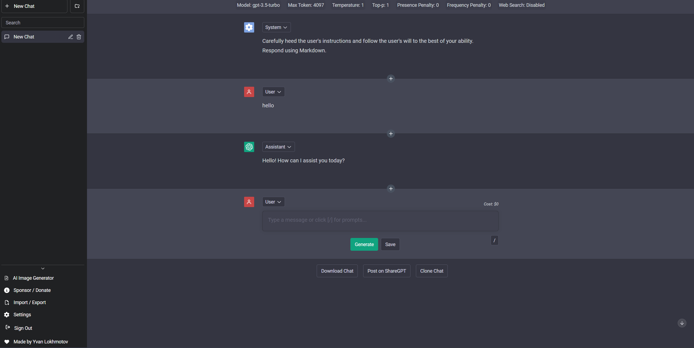

<h1 align="center"><b>BetterGPT-4</b></h1>

    

<h4 align="center"><b>Free, Powerful, Limitless, Intelligent, Engaging</b></h4>

    <a href="https://chat.ylokhmotov.dev">Enter Website</a>
    ·
    <a href="https://github.com/yvanlok/BetterGPT-4/issues/new/choose">Report Bug</a>
    ·
    <a href="https://github.com/yvanlok/BetterGPT-4/issues/new/choose">Request Feature</a>

<i>Did you enjoy using BetterGPT-4? Give it some love with a star! 🌟</i>

## 👋🏻 Introducing Better GPT

    

Are you ready to unlock the full potential of ChatGPT with BetterGPT-4?

BetterGPT-4 is the ultimate destination for anyone who wants to experience the limitless power of conversational AI. With no limits and completely free to use for all, our app harnesses the full potential of OpenAI's ChatGPT API alongside other AI LLM models such as Claude (from Anthropic) and Llama (from Meta) to offer you an unparalleled chatbot experience.

Whether you're looking to chat with a virtual assistant, improve your language skills, or simply enjoy a fun and engaging conversation, my fork has got you covered. So why wait? Join our users today and explore the exciting world of BetterGPT-4!

# 🔥 Features

BetterGPT-4 comes with a bundle of amazing features! Here are some of them:

- **FOREVER AND COMPLETELY FREE**
- Proxy to bypass ChatGPT regional restrictions
- Prompt library
- Organize chats into folders (with colours)
- Filter chats and folders
- ShareGPT integration
- Custom model parameters (e.g. presence_penalty)
- Chat as user / assistant / system
- Edit, reorder and insert any messages, anywhere
- Chat title generator
- Save chat automatically to local storage
- Import / Export chat
- Download chat (markdown / image / json)
- Sync to Google Drive
- Multiple language support (i18n)

# 🛠️ Usage

To get started, simply visit our website at <https://chat.ylokhmotov.dev/>!

# ⭐️ Star History

<h3 align="center">
A ⭐️ to <b>BetterGPT-4</b> is to make it shine brighter and benefit more people.
</h3>

# 🙏 Support

At BetterGPT-4, I strive to provide you with useful and amazing features around the clock. And just like any project, your support and motivation will be instrumental in helping me keep moving forward!

If you have enjoyed using my fork, I kindly ask you to give this project a ⭐️. Your endorsement means a lot to me and encourages me to work harder towards delivering the best possible experience.

Thank you for being a part of our community, and we look forward to serving you better in the future.
